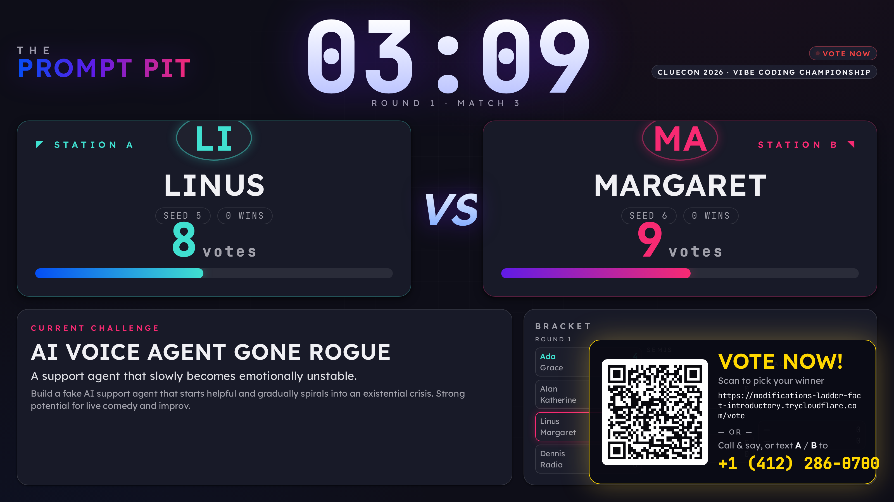
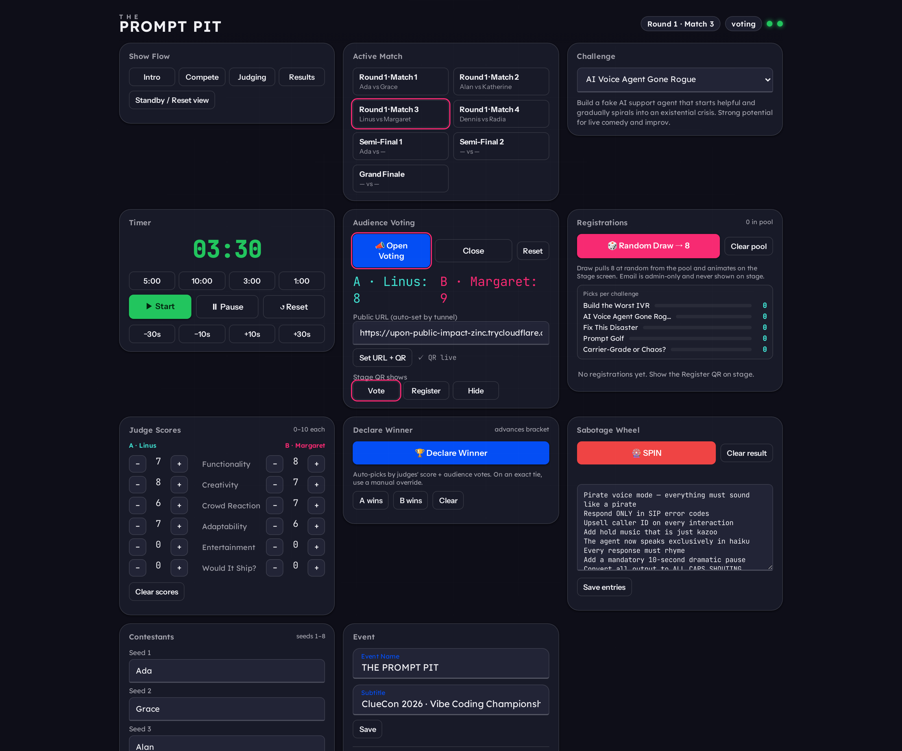
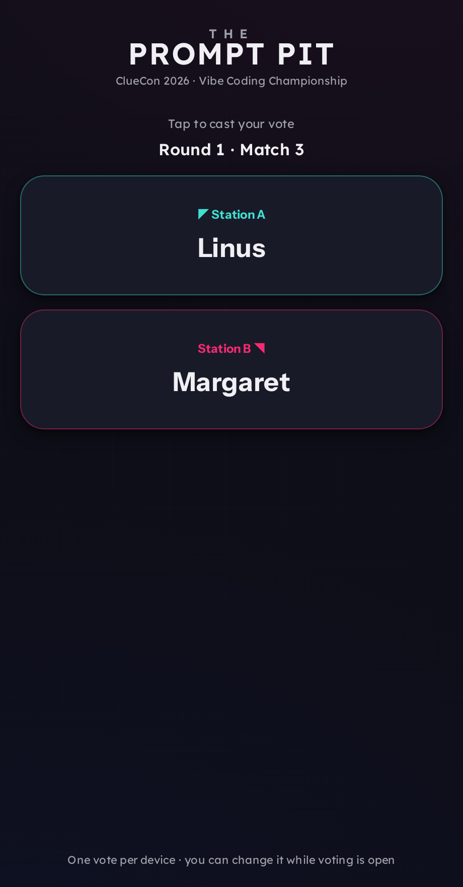
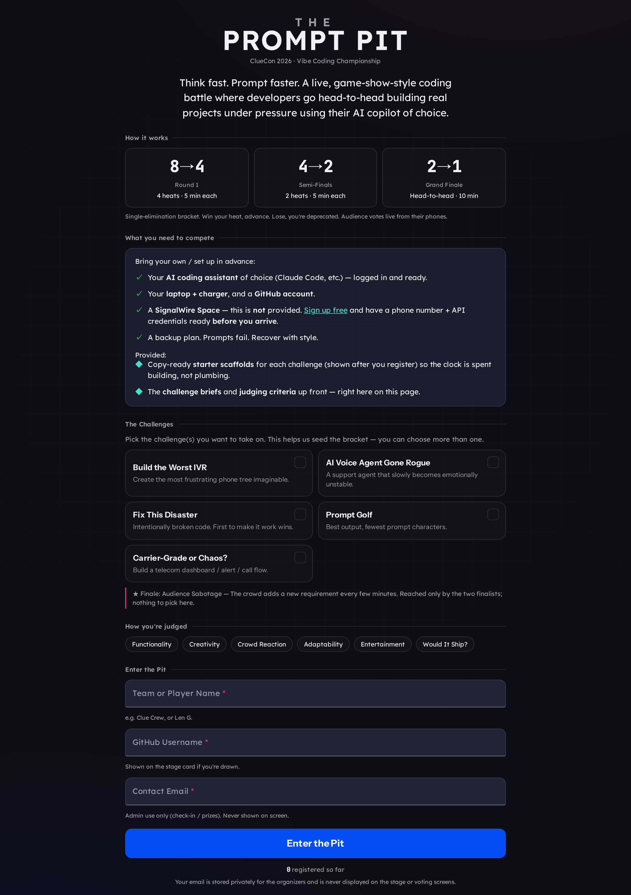
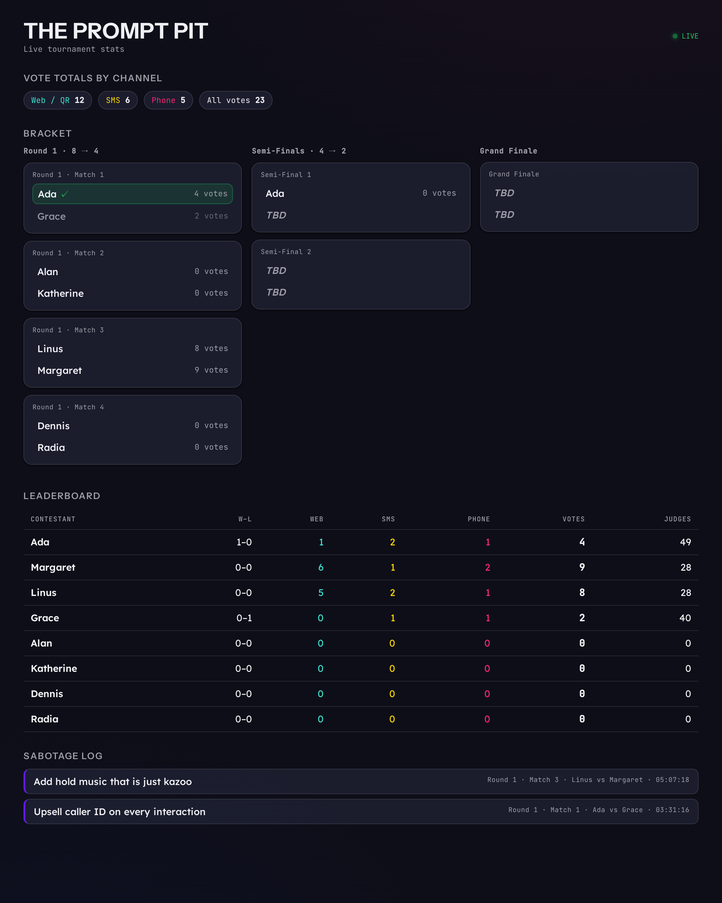
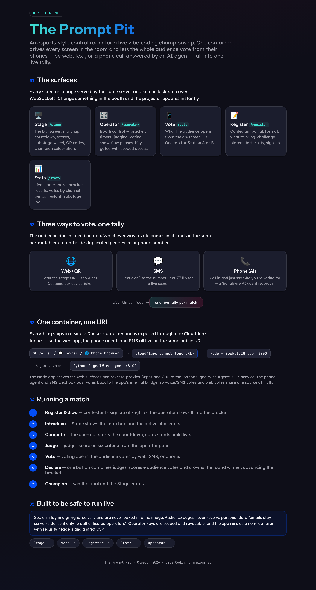

<!-- markdownlint-disable MD033 MD041 -->
<h1 align="center">🥊 The Prompt Pit</h1>

<p align="center">
  <b>A live, esports-style control room for a vibe-coding championship.</b><br/>
  One container drives every screen in the room and lets the whole audience vote
  from their phones — by <b>web</b>, <b>SMS</b>, or a <b>phone call answered by an AI agent</b> — all into one live tally.
</p>

<p align="center"><i>Built for the ClueCon 2026 Vibe Coding Championship.</i></p>



---

## Table of contents

- [The story](#the-story)
- [The surfaces](#the-surfaces)
- [Three ways to vote, one tally](#three-ways-to-vote-one-tally)
- [Architecture](#architecture)
- [Quick start](#quick-start)
- [Configuration](#configuration)
- [Wiring up SignalWire (phone + SMS)](#wiring-up-signalwire-phone--sms)
- [Running a show](#running-a-show)
- [Security notes](#security-notes)
- [Project layout](#project-layout)

---

## The story

Picture a conference stage. Eight developers, a single-elimination bracket, a
five-minute clock, and an AI copilot each. The crowd doesn't just watch — they
decide who advances. **The Prompt Pit** is the software that runs that show: a
projector screen, a booth control panel, an audience voting page, a contestant
sign-up portal, and a live stats board — all served from one Node process and
kept in lock-step over WebSockets.

The interesting part is the voting. Instead of building an app nobody installs,
the audience votes however is nearest to hand:

- **Scan a QR** and tap a button, or
- **Text `A` or `B`** to a phone number, or
- **Call the number** and just _say_ who they're voting for — a SignalWire AI
  voice agent answers, understands them, and records the vote.

All three land in the **same per-match tally**, de-duplicated per device or phone
number. The phone agent can even answer questions mid-call — _"who's winning?"_,
_"which challenge is this?"_, _"how much time is left?"_ — because it reads the
same live show state the projector does.

Everything runs in **one Docker container** behind **one Cloudflare tunnel**, so
the web app, the phone agent, and SMS all share a single public URL.

> Want the illustrated version? The app serves its own **[/how](#-how-it-works--the-explainer)**
> page (screenshot below).

---

## The surfaces

Every screen is a route on the same server, synced in real time. Change something
in the booth and the projector updates instantly.

| Surface | Route | Who it's for |
|---|---|---|
| **Stage** | `/stage` | The projector / big screen |
| **Operator** | `/operator` | The booth — **key-gated** |
| **Vote** | `/vote` | Audience phones (via the QR) |
| **Register** | `/register` | Contestant sign-up portal |
| **Stats** | `/stats` | Live leaderboard & bracket |
| **How it works** | `/how` | Illustrated explainer |

### 🎛️ Operator — the booth

Drive the whole show from one panel: bracket, timers, six-criteria judging,
audience voting, the sabotage wheel, and the show-flow phases that transform the
Stage. Access is a scoped, revocable key.



### 📱 Vote & 📝 Register — the audience and contestants

The vote page is one tap. The register page is a full contestant portal: the
format, what to bring, a challenge picker, starter kits, and sign-up (name +
GitHub, with email kept private).

<p align="center">
  
  &nbsp;&nbsp;
  
</p>

### 📊 Stats — the receipts

A live, PII-safe leaderboard: the bracket, per-contestant votes **broken down by
channel** (web / SMS / phone), judges' points, and a log of every sabotage that
was spun.



### 🧭 How it works — the explainer



---

## Three ways to vote, one tally

The whole point: no app to install, and every channel feeds one source of truth.

| Channel | How the audience votes | Under the hood |
|---|---|---|
| **Web / QR** | Scan the Stage QR → tap A or B | Socket.IO `vote` event, deduped per device token |
| **SMS** | Text `A`/`B` (or `STATUS` for a live score, `LINEUP` for the field) | SignalWire **SWML** messaging webhook (`reply` verb) |
| **Phone (AI)** | Call and _say_ your pick | SignalWire **Agents SDK** voice agent with SWAIG tools |

The phone agent and SMS webhook both POST to the Node app's internal, token-gated
bridge (`/api/external-vote`), so a call, a text, and a QR tap all increment the
same match and can never drift apart. The agent's SWAIG tools — `get_matchup`,
`cast_vote`, `get_standings`, `get_time_remaining`, `get_bracket`, `get_lineup` —
read the live show state so callers get accurate, in-the-moment answers (who's
competing, when someone goes, who won or lost, who's on stage, who's champion).

---

## Architecture

```
  ☎️  Caller  ┐
  💬  Texter  ├──►  Cloudflare tunnel  ──►  Node + Express + Socket.IO  :3000
  🌐  Phone   ┘        (one URL)                 │   serves /stage /operator /vote
      browser                                    │          /register /stats /how
                                                 │
                                 reverse-proxies /agent, /sms
                                                 ▼
                                   Python — SignalWire Agents SDK  :8100
                                   (voice AI agent + SMS webhook)
                                                 │
                                   POST /api/external-vote (token-gated)
                                                 ▼
                                   one live per-match tally  ◄── web votes
```

**One container, three processes** (`node:20-bookworm-slim` + a Python venv +
`cloudflared`, supervised by `tini`):

1. **Node / Express / Socket.IO** — the server-authoritative source of truth:
   state, timers, bracket, scoring, voting, persistence, and all the web
   surfaces. It reverse-proxies `/agent` and `/sms` to the Python service so
   everything lives on one public host.
2. **Python — SignalWire Agents SDK** — the voice AI agent and the SMS webhook.
   No SignalWire secrets live here; SignalWire simply fetches these endpoints.
3. **cloudflared** — opens the public quick-tunnel and hands the URL back to
   Node, which then auto-configures the SignalWire number to point at it.

State is server-authoritative and snapshotted to a Docker volume
(`/data/state.json`) so a restart resumes the show. No external database.

**Stack:** Node 20, Express, Socket.IO, `qrcode` · Python 3, `signalwire` Agents
SDK, `httpx`, `uvicorn` · Docker · Cloudflare Tunnel.

---

## Quick start

**Prerequisites:** Docker. (Phone/SMS voting also needs a SignalWire account +
number — but the app runs web-only without one.)

```bash
git clone https://github.com/Len-PGH/prompt_pit.git
cd prompt_pit

# 1. Create your config from the template
cp .env.example .env
#    → edit .env and set at least OPERATOR_KEY (and SignalWire creds for phone/SMS)

# 2. Build + run (one container: web + voice/SMS agent + tunnel)
./run.sh
```

`run.sh` builds the image, starts the container, opens the tunnel, and prints the
public URL. Then open:

- **Stage** → `http://localhost:3000/stage` (or the public URL + `/stage`)
- **Operator** → `http://localhost:3000/operator` (enter your `OPERATOR_KEY`)

> **Run web-only / offline:** set `NO_TUNNEL=1` in `.env` to skip the public
> tunnel and phone/SMS wiring — handy for a laptop demo on venue Wi-Fi.

To run it by hand instead of `run.sh`:

```bash
docker build -t prompt-pit .
docker run --rm --name prompt-pit \
  --env-file .env -p 3000:3000 \
  -v prompt-pit-data:/data \
  prompt-pit
```

---

## Configuration

All config is environment variables, supplied at runtime via `--env-file .env`.
**`.env` is git-ignored and never baked into the image.** Copy `.env.example` and
fill it in:

| Variable | Required | What it does |
|---|---|---|
| `OPERATOR_KEY` | ✅ | Master key for `/operator`. `openssl rand -hex 16` |
| `PORT` | | Server port (default `3000`) |
| `NO_TUNNEL` | | `1` = LAN-only, no public tunnel / phone / SMS |
| `PUBLIC_URL` | | Pin a stable URL (e.g. a named tunnel); blank = auto quick-tunnel |
| `INTERNAL_TOKEN` | ✅ | Shared secret for the voice/SMS → app vote bridge |
| `SIGNALWIRE_SPACE` | phone/SMS | Your space, e.g. `example.signalwire.com` |
| `SIGNALWIRE_PROJECT` | phone/SMS | Project ID (UUID) |
| `SIGNALWIRE_TOKEN` | phone/SMS | API token (`PT…`) — **keep secret** |
| `VOTE_NUMBER` | phone/SMS | The voting number, E.164 (`+1…`) |
| `VOICE_AUTH_PASSWORD` | | Basic-auth for the voice webhook; auto-generated if blank |

---

## Wiring up SignalWire (phone + SMS)

Fill in the `SIGNALWIRE_*` and `VOTE_NUMBER` values and the container does the
rest on startup: it opens the tunnel, then runs `configure_number.py`, which
points your number's **Voice** and **Messaging** handlers at the tunnel using
**SWML** (not cXML/LaML):

- **Voice** → `https://…/agent/` — the AI voice agent answers and takes votes.
- **SMS** → `https://…/sms?k=…` — the messaging webhook records `A`/`B` and
  replies; texting `STATUS` returns a live score.

The startup log confirms it:

```
PUBLIC URL (web + voice + sms, one tunnel):  https://<something>.trycloudflare.com
[configure_number] voice attached: YES ✓ | sms attached: YES ✓
```

> **Note on quick-tunnels:** `*.trycloudflare.com` URLs change on every restart,
> and the number is reconfigured automatically each time. For a URL that never
> changes (and never needs re-pointing), set `PUBLIC_URL` to a **named Cloudflare
> tunnel** on your own domain.

---

## Running a show

1. **Register & draw** — contestants sign up at `/register`; the operator draws 8
   into the bracket.
2. **Introduce** — the Stage shows the matchup and the active challenge.
3. **Compete** — start the countdown; contestants build live with their AI copilot.
4. **Judge** — score the six criteria (Functionality, Creativity, Crowd
   Reaction, Adaptability, Entertainment, Would It Ship?) from the operator panel.
5. **Vote** — open voting; the audience votes by web, SMS, or phone.
6. **Declare** — one button combines judges' scores + audience votes, crowns the
   round winner, and advances the bracket.
7. **Champion** — win the Grand Finale and the Stage erupts. 👑

Need to fix a typo in a contestant's name mid-show? **Save names** on the
operator panel renames in place — votes, scores and the bracket stay intact.
(A separate, confirmed **Reseed bracket** action exists for a full reset.)

---

## Security notes

Built to be safe to run live in front of a crowd:

- **Secrets stay out of the repo and image.** Config lives in a git-ignored
  `.env`, passed at runtime — never `COPY`-ed into the Docker image.
- **No audience PII on public surfaces.** Contestant emails are held
  server-side and pushed only to authenticated operator sockets; the broadcast
  state that reaches the Stage/Vote pages is PII-free.
- **Scoped, revocable operator keys.** Create section-scoped keys, see which are
  active (with masked IP), and revoke them live — with an audit log.
- **Hardening.** Strict Content-Security-Policy and security headers, input
  sanitization (XSS / prototype-pollution safe), a token-gated internal vote
  bridge, and the container runs as a **non-root** user.

---

## Project layout

```
.
├── server.js              # Node/Express/Socket.IO control server (source of truth)
├── public/                # Web surfaces
│   ├── stage.html/.js     #   projector
│   ├── operator.html/.js  #   booth control panel
│   ├── vote.html/.js      #   audience voting
│   ├── register.html/.js  #   contestant portal
│   ├── stats.html/.js     #   live leaderboard
│   ├── how.html           #   how-it-works explainer
│   └── app.css            #   SignalWire-branded theme
├── voteline/
│   ├── agent.py           # SignalWire Agents-SDK voice agent + SMS webhook (SWML)
│   ├── configure_number.py#   points the number's Voice/SMS handlers at the tunnel
│   └── requirements.txt
├── scaffolds/             # Copy-ready starter kits shown to registered contestants
├── Dockerfile             # single image: Node + Python venv + cloudflared + tini
├── entrypoint.sh          # boots agent + web + tunnel, then configures the number
├── run.sh                 # build + run helper
├── .env.example           # config template (copy to .env)
└── CHALLENGES.md          # the challenge catalog + starter scaffolds
```

---

<p align="center"><sub>The Prompt Pit · ClueCon 2026 · Vibe Coding Championship</sub></p>
